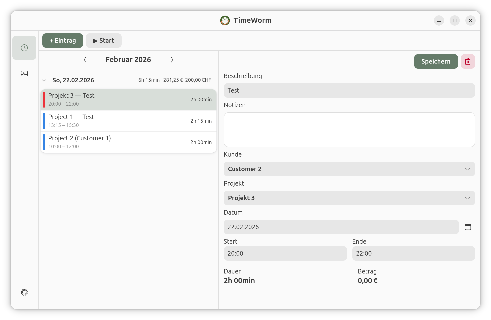

<p align="center">
  
</p>

<h1 align="center">TimeWorm 🐛</h1>

<p align="center">
  A lightweight, native GTK4/Adwaita time tracker for freelancers and small teams.
</p>

<p align="center">
  
  
  
  
</p>

---

<p align="center">
  
</p>

## What is TimeWorm?

TimeWorm is a simple, fast, and beautiful time tracking application built for the GNOME desktop. It tracks your hours, calculates amounts based on configurable hourly rates, and exports professional invoices as PDF, Excel, or CSV.

No cloud. No subscription. No electron. Just a native Linux app that does one thing well.

## Features

### ⏱ Time Tracking
- **One-click timer** — Start/stop with a single button
- **Manual entry** — Add entries for past work
- **Live timer** — Running timer visible in day overview
- **Day grouping** — Entries grouped by date with daily totals
- **Smart quantization** — Configurable rounding (e.g. 15-minute blocks)

### 📊 Reports
- **Monthly overview** — Revenue and hours per customer/project
- **Visual progress bars** — See workload distribution at a glance
- **Customer filter** — Focus on a single client
- **Multi-currency totals** — Separate sums when projects use different currencies

### 📤 Export
- **PDF** — Professional "Stundennachweis" with summary + detail tables, automatic word-wrap
- **Excel** — Full data export with summary sheet
- **CSV** — For further processing in any tool
- **Smart file naming** — `timeworm-2026-02.pdf` with remembered export folder

### 💰 Flexible Billing
- **Per-project currency** — €, $, ¥, £, CHF, kr
- **Per-project hourly rate** — Different rates for different work
- **Time quantization** — Round to 15min, 30min, 1h, or any custom interval
- **Locale-aware formatting** — German: `1.234,56 €` · English: `€1,234.56` · Japanese: `2026/02/22`

### 🌍 Internationalization
9 languages with full UI translation:

| Language | Status |
|----------|--------|
| 🇩🇪 Deutsch | ✅ Base language |
| 🇬🇧 English | ✅ Complete |
| 🇫🇷 Français | ✅ Complete |
| 🇪🇸 Español | ✅ Complete |
| 🇧🇷 Português (Brasil) | ✅ Complete |
| 🇳🇱 Nederlands | ✅ Complete |
| 🇯🇵 日本語 | ✅ Complete |
| 🇰🇷 한국어 | ✅ Complete |
| 🇨🇳 简体中文 | ✅ Complete |

Set language via environment: `LANGUAGE=ja timeworm`

### 🖥 Desktop Integration
- **GNOME desktop file** — Shows in app launcher
- **Flatpak ready** — Manifest included for Flathub packaging
- **AppStream metadata** — For GNOME Software / Discover

## Installation

### From Source (recommended for development)

```bash
# Dependencies (Fedora/GNOME)
sudo dnf install python3-gobject gtk4 libadwaita python3-pip

# Dependencies (Ubuntu/Debian)
sudo apt install python3-gi gir1.2-gtk-4.0 gir1.2-adw-1 python3-pip

# Clone and install
git clone https://github.com/tombehrends/timeworm.git
cd timeworm
python3 -m venv .venv --system-site-packages
source .venv/bin/activate
pip install -e .

# Run
timeworm
```

### Desktop Launcher

```bash
# Create desktop entry
cp com.instantolap.timeworm.desktop ~/.local/share/applications/
# Edit Exec= path to point to your venv:
# Exec=/path/to/timeworm/.venv/bin/timeworm
```

### Flatpak (coming soon)

```bash
flatpak install flathub com.instantolap.timeworm
flatpak run com.instantolap.timeworm
```

## Data Storage

TimeWorm stores all data locally in a SQLite database:

```
~/.local/share/timeworm/timeworm.db
```

No telemetry. No cloud sync. Your data stays on your machine.

## Project Structure

```
timeworm/
├── timeworm/
│   ├── app.py              # Application entry point
│   ├── db/                 # Database schema + migrations
│   ├── repository.py       # Data access layer
│   ├── formatting.py       # Locale-aware number/date/currency formatting
│   ├── i18n.py             # Internationalization (gettext)
│   ├── ui/
│   │   ├── dockbar.py      # Sidebar navigation
│   │   ├── time_tracking.py # Main time tracking view
│   │   ├── reports.py      # Monthly reports + export
│   │   └── settings.py     # Customer/project management
│   └── export/
│       └── exporter.py     # PDF/Excel/CSV export
├── po/                     # Translations (.po/.mo files)
│   ├── generate_translations.py  # Build all translations
│   └── locale/             # Compiled .mo files
├── data/icons/             # App icon (SVG)
├── com.instantolap.timeworm.json    # Flatpak manifest
├── com.instantolap.timeworm.desktop # Desktop entry
└── com.instantolap.timeworm.metainfo.xml  # AppStream metadata
```

## MCP Integration

TimeWorm includes a [Model Context Protocol](https://modelcontextprotocol.io/) server that enables AI assistants to interact with your time tracking data:

```bash
cd mcp && pip install -e .
```

**Available MCP tools:**
- `tw_start_timer` / `tw_stop_timer` — Start and stop tracking
- `tw_log_time` — Add a manual time entry
- `tw_entries` — Query entries by date range
- `tw_summary` — Get monthly/project summaries
- `tw_list_customers` / `tw_list_projects` — Browse data
- `tw_status` — Check running timer

## Contributing

Contributions welcome! Especially:

- **Translations** — Improve existing or add new languages (edit `po/generate_translations.py`)
- **Bug reports** — Open an issue
- **Features** — Fork, branch, PR

## Tech Stack

- **Python 3.11+** — Application logic
- **GTK4 / Adwaita** — Native GNOME UI
- **SQLite** — Local data storage
- **ReportLab** — PDF generation
- **OpenPyXL** — Excel export
- **gettext** — Internationalization
- **Node.js** — MCP server (optional)

## License

MIT License — see [LICENSE](LICENSE) for details.

---

<p align="center">
  <strong>TimeWorm</strong> 🐛<br>
  Made with ❤️ in Hamburg
</p>
